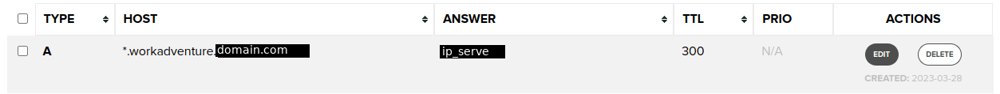

 [](https://discord.gg/G6Xh9ZM9aR)


Live demo [here](https://play.staging.workadventu.re/@/tcm/workadventure/wa-village).

# WorkAdventure

WorkAdventure is a web-based collaborative workspace presented in the form of a
16-bit video game.

In WorkAdventure you can move around your office and talk to your colleagues (using a video-chat system, triggered when you approach someone).

See more features for your virtual office: https://workadventu.re/virtual-office


## My Config
### I have done :
#### Get good version of project Workadventure in my own depot:
go GitHub in official depot clone all project [link GitHub](https://github.com/thecodingmachine/workadventure)
go in folder project
set up new remote (git@github.com:Tristancals/workadventure.git for me)
```shell
git clone https://github.com/thecodingmachine/workadventure.git
cd workadventure
git add remote <remote_name> <your_link_to_our_own_depot_git>
```
checkout on tag v1.15.6 this version work fine
put it on your new branch (main for me)
and go on it
```shell
git checkout v1.15.6
git branch <branch_name>
git checkout <branch_name>
```
push this branch on my own depot
```shell
git push -u <remote_name>
```
now normally you have repository with good version of project

### Log in your remote server
my remote server OS debian 11
install some utils maybe you need more
```shell
sudo -i
apt update
apt upgrade -y
apt install git -y
apt install docker docker-compose -y
```
for clone my repository
```shell
apt install openssh-server
ssh-keygen -t rsa
```
and go in GitHub for set your new ssh key.. (google ^^as your friend)
clone your project
```shell
git clone <your_link_to_our_own_depot_git>
```
### Setup your config workadventure repository
#### Setup DNS
go in your domain name supplier
setup new subdomain for your domain name with *.workadventure for accept all type of subdomain at workadventure  

(ip server.. )
#### Setup .env
copy <project_folder>/contrib/docker/.env.prod.template in <project_folder>/.env
```shell
cp contrib/docker/.env.prod.template .env
```
setup value
```.env
11 SECRET_KEY=<random_string>

24 DOMAIN=workadventure.<domaine_name>

29 FRONT_HOST=play.workadventure.<domaine_name>
30 CHAT_HOST=chat.workadventure.<domaine_name>
31 PUSHER_HOST=play.workadventure.<domaine_name>
32 BACK_HOST=api.workadventure.<domaine_name>
33 MAP_STORAGE_HOST=map-storage.workadventure.<domaine_name>
34 MAPS_HOST=maps.workadventure.<domaine_name>
35 ICON_HOST=icon.workadventure.<domaine_name>
36 UPLOADER_HOST=uploader.workadventure.<domaine_name>
37 EJABBERD_HOST=ejabberd.workadventure.<domaine_name>

# depot of map was changed no more .json... but tmj
56 START_ROOM_URL=/_/global/thecodingmachine.github.io/workadventure-map-starter-kit/map.tmj

#used for pull good tag of docker images
62 VERSION=v1.15.6

118 EJABBERD_DOMAIN=ejabberd.workadventure.<domaine_name>
121 EJABBERD_WS_URI=wss://ejabberd.workadventure.<domaine_name>:5443/ws
```
#### Setup docker-compose.yaml
copy <project_folder>/contrib/docker/docker-compose.prod.yaml in <project_folder>/docker-compose.yaml
you can copy docker-compose.yaml in docker-compose.yaml.bak for make save..
```shell
cp docker-compose.yaml docker-compose.yaml.bak
cp /contrib/docker/docker-compose.prod.yaml docker-compose.yaml
```
```yaml
  back:
    image: thecodingmachine/workadventure-back:${VERSION}
    environment:
#      - PLAY_URL=https://${PLAY_HOST} <== ERROR TYPO
      - PLAY_URL=https://${FRONT_HOST} # <== GOOD TYPO
      - SECRET_JITSI_KEY
      - ENABLE_FEATURE_MAP_EDITOR
      - SECRET_KEY
#      - ADMIN_API_TOKEN <== YOU DON'T NEED
#      - ADMIN_API_URL <== YOU DON'T NEED
      - TURN_SERVER
```

### Launch app
build and run project
-d for detach cmd window
```shell
docker-compose up -d
``` 
logs for see log of build and run for debug
```shell
docker-compose logs -f
```

Enjoy!


## Community resources

Check out resources developed by the WorkAdventure community at [awesome-workadventure](https://github.com/workadventure/awesome-workadventure)

## Setting up a production environment

The way you set up your production environment will highly depend on your servers.
We provide a production ready `docker-compose` file that you can use as a good starting point in the [contrib/docker](https://github.com/thecodingmachine/workadventure/tree/master/contrib/docker) directory.

## Setting up a development environment

> **Note**
> These installation instructions are for local development only. They will not work on
> remote servers as local environments do not have HTTPS certificates.

Install Docker and clone this repository.

> **Warning**
> If you are using Windows, make sure the End-Of-Line character is not modified by the cloning process by setting
> the `core.autocrlf` setting to false: `git config --global core.autocrlf false`

Run:

```
cp .env.template .env
docker-compose up
```

The environment will start.

You should now be able to browse to http://play.workadventure.localhost/ and see the application.
You can view the Traefik dashboard at http://traefik.workadventure.localhost

Note: on some OSes, you will need to add this line to your `/etc/hosts` file:

**/etc/hosts**
```
127.0.0.1 oidc.workadventure.localhost redis.workadventure.localhost play.workadventure.localhost chat.workadventure.localhost traefik.workadventure.localhost xmpp.workadventure.localhost extra.workadventure.localhost icon.workadventure.localhost map-storage.workadventure.localhost uploader.workadventure.localhost maps.workadventure.localhost api.workadventure.localhost front.workadventure.localhost
```

You can also start WorkAdventure + a test OpenID connect server using:

```console
$ docker-compose -f docker-compose.yaml -f docker-compose-oidc.yaml up
```

(Test user is "User1" and his password is "pwd")


### Troubleshooting

See our [troubleshooting guide](docs/dev/troubleshooting.md).
